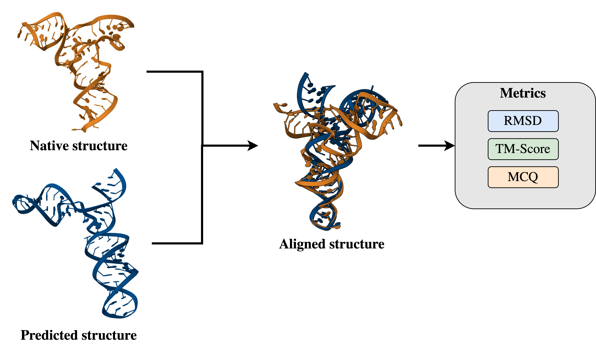

# Coarse-Grained RMSD Calculation and Metric Correlation Analysis



# Project Description
This project computes the Coarse-Grained RMSD (CGRMSD) for RNA or protein structures and analyzes its correlation with three metrics: RMSD, MCQ, and TM-Score. The goal is to identify which coarse-grained atomic representation provides the highest correlation with these metrics, offering insights into their specificities.

1. **CGRMSD Calculation**: Computes RMSD between coarse-grained representations of native and predicted structures.
2. **Correlation Analysis**: Computes Pearson correlation matrices for CGRMSD against RMSD, MCQ, and TM-Score.
3. **Custom Atom Selection**: Allows specifying coarse-grained atoms for CGRMSD computation (C3', C4', P ...).
   
The coarse-grained representation with the highest correlation to RMSD, MCQ, and TM-Score is identified by comparing the correlation matrices produced for different atom sets (e.g., C4', P, etc.). These results are analyzed to provide insights into how well CGRMSD reflects these metrics and their differences.

## Install required dependencies
```
pip install numpy pandas biopython argparse
```

## Files and Directories
1. **Native Files**: Directory containing .pdb files for native structures.
2. **Predicted Files**: Directory containing .pdb files for predicted structures (subdirectories for each structure).
3. **CSV Files**: Directory with .csv files containing predicted structure scores and filenames. Updated with CGRMSD values post-processing.

## Usage
The script is executed using the command line with two modes: __single__ and __all__.

### Single file processing 
Calculate CGRMSD for one pair of files:
```
python script.py single <atom_names> --native_file <path_to_native.pdb> --predict_file <path_to_predicted.pdb> --csv_file <path_to_csv.csv>
```
Example:
```
python CGRMSD.py single "C4'" "C3'" \
  --native_file /path/to/native.pdb \
  --predict_file /path/to/predict.pdb \
  --csv_file /path/to/scores.csv
```
### Processing all Structures
Calculate CGRMSD for all files in directories:
```
python script.py all <atom_names> --native_dir <path_to_native_dir> --predict_dir <path_to_predicted_dir> --csv_dir <path_to_csv_dir>
```
Example: 
```
python CGRMSD.py all "C4'" "C3'" \
  --native_dir /path/to/native_directory \
  --predict_dir /path/to/predict_directory \
  --csv_dir /path/to/csv_directory
```

## Outputs
- **Updated CSV Files**: The original CSV files are updated with a new column containing CGRMSD values for each prediction.
- **Correlation Matrices**: Saved in a subdirectory (cormat/) within the csv_dir.

## Key Functions
- **get_atoms()**: Extracts specified coarse-grained atoms from a structure.
- **calculate_rmsd()**: Computes RMSD for aligned atoms.
- **process_single_structure()**: Computes CGRMSD for one native and predicted structure.
- **process_all_structures()**: Processes multiple native and predicted structures from directories.
- **calculate_correlation()**: Computes Pearson correlation matrices for numerical data in the CSV.

## Contact
- **Mai Huong Pham** - huongpham1797@gmail.com
- **Cristina Marianini** - cristina.mr.2001@gmail.com
- **Lodhi Laiqa Zia** - laiqazialodhi@gmail.com
